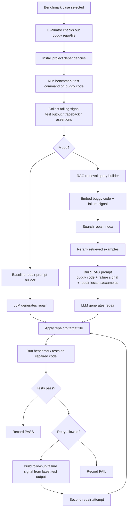

# Repair Workflow

## Notes

- Shared path: checkout -> install -> run tests -> collect failure signal -> generate repair -> rerun tests.
- Baseline uses `buggy_code + failure_signal`.
- RAG uses `buggy_code + failure_signal + retrieved examples / repair lessons`.
- Retry behavior depends on benchmark configuration:
  - QuixBugs best setup used multi-candidate selection.
  - PyBugHive currently benefits a lot from follow-up repair attempts with updated failure signals.
